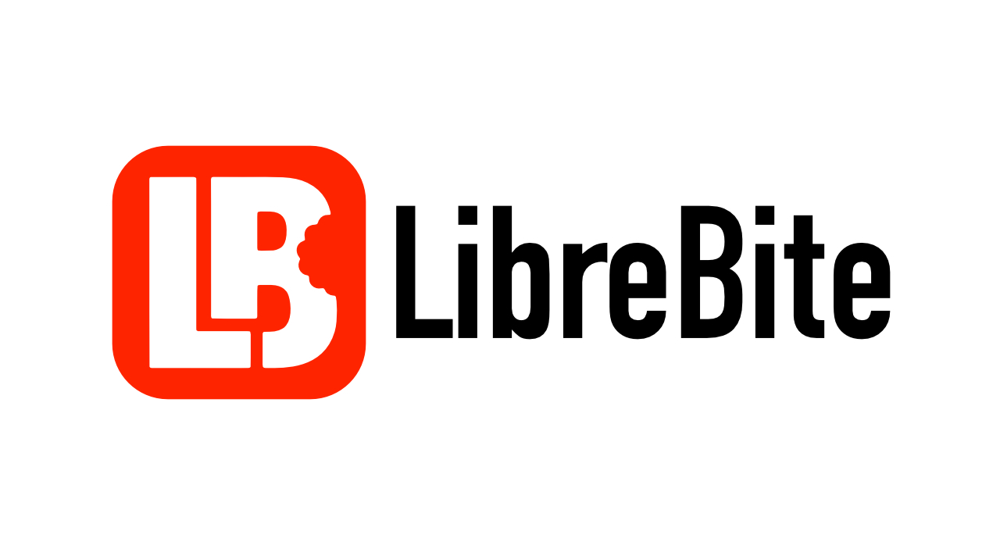

  

# Libre Bite

**WooCommerce-Erweiterung für Gastronomie und Food-Business**

> **Pro-Version:** Libre Bite bietet ein modulares Freemium-Modell. Während die Kernfunktionen kostenlos sind, können erweiterte Features über ein Pro-Abonnement (via Freemius) freigeschaltet werden.

---

## Funktionen im Überblick

### Kostenlose Features
- **Basis-Standortverwaltung** - Verwaltung einer Filiale mit Adresse und Öffnungszeiten.
- **Kanban-Dashboard** - Real-time Bestellübersicht für die Küche.
- **POS/Kassensystem** - Oberfläche für Walk-in-Kunden vor Ort.
- **5-Rappen-Rundung** - Unterstützung für Schweizer Währungskonventionen.
- **Produkt-Optionen** - Basis-Verwaltung für Add-ons und Extras.

### Pro-Features (Abonnement erforderlich)
- **Multi-Standortverwaltung** - Mehrere Filialen zentral verwalten und synchronisieren.
- **Optimierter Checkout** - Conversion-optimierter und vereinfachter Bestellvorgang.
- **Erweitertes Trinkgeld-System** - Flexible Prozent-Vorschläge und individuelle Beträge.
- **Abhol-Erinnerungen** - Automatische E-Mail-Reminder an Kunden vor Bereitstellung.
- **Nährwerte & Allergene** - Vollständige EU-konforme Produktkennzeichnung.
- **Erweiterte Benachrichtigungen** - Individuelle Sounds und Alert-Optionen.

---

## Systemanforderungen

| Komponente | Minimum |
|------------|---------|
| WordPress | 6.0+ |
| WooCommerce | 8.0+ |
| PHP | 7.4+ |
| MySQL | 5.6+ / MariaDB 10.0+ |

---

## Download & Installation

Die stabilen Versionen des Plugins können direkt über die GitHub **Releases** heruntergeladen werden:

👉 **[Download der neuesten Version](https://github.com/simurech/libre-bite/releases)**

1. Laden Sie die `libre-bite.zip` aus dem neuesten Release herunter.
2. Gehen Sie in Ihrem WordPress-Backend zu **Plugins → Installieren → Plugin hochladen**.
3. Aktivieren Sie das Plugin nach dem Hochladen.

---

## Lizenz & Autor

**Lizenz:** GPL-2.0-or-later
**Autor:** Simon Urech - [@simurech](https://github.com/simurech)