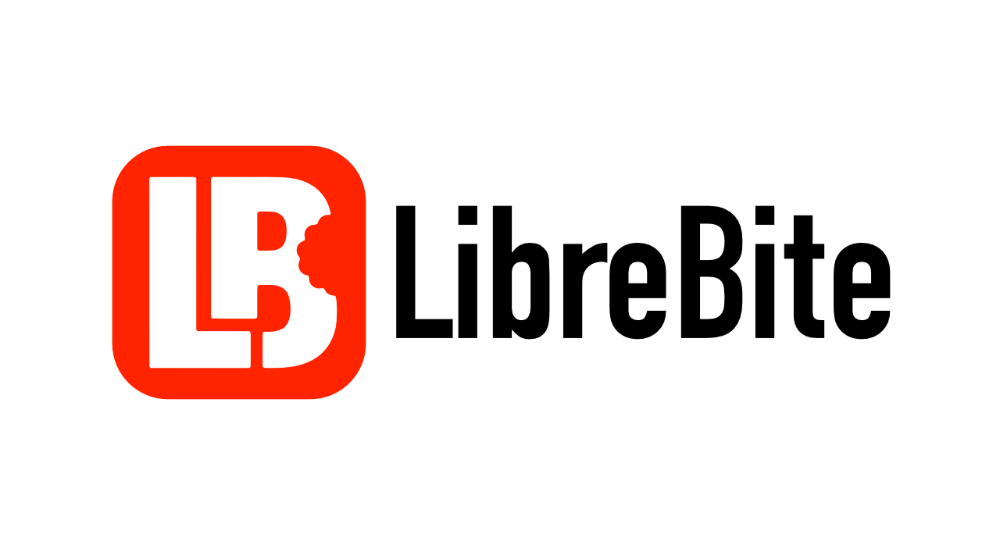

<p align="center">
  
</p>

# Libre Bite

**Die WooCommerce-Erweiterung für Restaurants, Take-Aways, Cafés und Bars.**

[](https://github.com/simurech/libre-bite/releases)
[](https://wordpress.org/)
[](https://woocommerce.com/)
[](https://php.net/)
[](https://www.gnu.org/licenses/gpl-2.0.html)

> Libre Bite verwandelt WooCommerce in ein vollständiges Restaurantverwaltungssystem — mit Live-Kanban-Bestellboard, integriertem Kassensystem, Standortverwaltung, individuellem Checkout und mehr. Deine Daten bleiben in deiner eigenen WordPress-Installation. Keine Plattformgebühren. Kein Vendor-Lock-in.

---

## Für wen ist Libre Bite?

| Betriebsart | Was Libre Bite hinzufügt |
|---|---|
| Restaurant | Live-Küchenboard, Bestellweiterleitung, Zeitfenster |
| Take-Away / Schnellgastronomie | Kassensystem für Thekenpersonal, schneller Bestellprozess |
| Café / Bar | Produkt-Add-ons, Trinkgeldsystem, Bestellnotizen |
| Gastrobetrieb mit mehreren Standorten | Filialen verwalten, standortbezogenes Kanban (Pro) |

---

## Funktionen

### Kostenlose Funktionen

| Funktion | Beschreibung |
|---|---|
| **Live Kanban-Bestellboard** | Echtzeit-Bestellkarten, Drag-&-Drop-Statusaktualisierung (Neu → In Bearbeitung → Bereit → Abgeschlossen) |
| **Integriertes Kassensystem (POS)** | Browserbasierte Kassenoberfläche für Lauf- und Thekenkundschaft |
| **Standortverwaltung** | Einzelfiliale mit Adresse, Öffnungszeiten und Bestellweiterleitung |
| **Schweizer 5-Rappen-Rundung** | Automatische Rundung auf 5 Rappen für CHF-Barzahlungen |
| **Zeitfenster im Checkout** | Kunden wählen ein Abholungs- oder Lieferzeitfenster beim Bestellen |
| **Produkt-Add-ons** | Konfigurierbare Extras pro Produkt (Toppings, Saucen, Grössen) mit Preisaufschlägen |
| **Modulsteuerung** | Nur die Funktionen aktivieren, die der Betrieb wirklich braucht |
| **HPOS-kompatibel** | Vollständig getestet mit WooCommerce High-Performance Order Storage |

### Pro-Funktionen

| Funktion | Beschreibung |
|---|---|
| **Mehrstandort-Verwaltung** | Beliebig viele Filialen, jede mit eigenem Kanban-Board und POS-Konfiguration |
| **Optimierter Bestellvorgang** | Konversionsorientierter Checkout für Gastronomiebetriebe |
| **Erweitertes Trinkgeldsystem** | Prozentuale Vorschläge + freie Eingabe, pro Bestellung gespeichert |
| **Automatische Abholungserinnerungen** | E-Mail-Erinnerungen X Minuten vor geplantem Abholzeitpunkt |
| **Nährwertangaben & Allergenkennzeichnung** | EU-konforme Kennzeichnung auf Produktseiten und im Checkout |
| **Erweiterte Sound-Benachrichtigungen** | Browsersignal bei neuer Bestellung, pro Standort konfigurierbar |

---

## Architektur

Libre Bite verwendet eine modulare, klassenbasierte Architektur. Jeder Funktionsbereich ist ein eigenes Modul, das basierend auf den Admin-Einstellungen bedingt geladen wird.

```
libre-bite/
├── libre-bite.php          # Plugin-Bootstrap, Freemius-Init
├── includes/
│   ├── core/               # Installer, Loader, Konstanten
│   ├── admin/              # Admin-Menüs, Einstellungsseiten
│   ├── modules/            # Funktionsmodule (Kanban, POS, Standorte, Checkout …)
│   └── frontend/           # Checkout-Hooks, öffentliche Ausgabe
├── assets/
│   ├── css/                # Admin- und Frontend-Stylesheets
│   └── js/                 # Kanban Drag & Drop, POS-Oberfläche, Checkout-Skripte
└── vendor/
    └── freemius/           # Freemius SDK (Lizenz- und Abonnementverwaltung)
```

---

## Systemanforderungen

| Komponente | Minimum | Empfohlen |
|---|---|---|
| WordPress | 6.0 | Aktuellste Version |
| WooCommerce | 8.0 | Aktuellste Version |
| PHP | 7.4 | 8.1+ |
| MySQL | 5.6 | 8.0+ / MariaDB 10.4+ |

---

## Installation

**Über WordPress.org (empfohlen):**
1. Im WordPress-Dashboard zu **Plugins → Installieren** navigieren.
2. Nach „Libre Bite" suchen.
3. Auf **Jetzt installieren** klicken, dann **Aktivieren**.

**Manuelle Installation via GitHub:**
1. Die neueste Release-`.zip` von der [Releases-Seite](https://github.com/simurech/libre-bite/releases) herunterladen.
2. In WordPress zu **Plugins → Installieren → Plugin hochladen** navigieren.
3. Die `.zip`-Datei hochladen und aktivieren.

**Nach der Aktivierung:**
1. Sicherstellen, dass WooCommerce aktiv ist.
2. Im Admin-Menü zu **Libre Bite** navigieren.
3. Benötigte Module aktivieren und Standort(e) konfigurieren.

---

## Screenshots

> Screenshots befinden sich im `assets/`-Verzeichnis auf der WordPress.org-Plugin-Seite.

| Nr. | Beschreibung |
|---|---|
| 1 | Kanban-Bestellboard — Echtzeit-Küchenanzeige |
| 2 | Kassenoberfläche (POS) — Thekenbestellerfassung |
| 3 | Standorteinstellungen — Filialadresse und Öffnungszeiten |
| 4 | Zeitfenster im Checkout — Kundenauswahl des Abholzeitfensters |
| 5 | Produkt-Add-ons — konfigurierbare Extras pro Menüpunkt |
| 6 | Moduleinstellungen — Funktionen nach Bedarf ein-/ausschalten |

---

## Freemius & Datenschutz

Libre Bite nutzt [Freemius](https://freemius.com) für die Verwaltung von Pro-Lizenzen und die Bereitstellung von Plugin-Updates für zahlende Abonnenten. Die Freemius-Integration ist **ausschliesslich Opt-in** — es werden keine Daten übermittelt, solange du bei der Plugin-Aktivierung nicht aktiv zustimmst.

Bei erteilter Zustimmung erfasst Freemius grundlegende Informationen zur Website-Umgebung (WordPress-Version, PHP-Version, Liste aktiver Plugins) für die Lizenzvalidierung und Nutzungsanalyse. Es werden keinerlei Bestell-, Kunden- oder Produktdaten übertragen.

- [Datenschutzerklärung von Freemius](https://freemius.com/privacy/)
- [Nutzungsbedingungen von Freemius](https://freemius.com/terms/)

---

## Lizenz

**Libre Bite** steht unter der [GNU General Public License v2.0 oder später](https://www.gnu.org/licenses/gpl-2.0.html).

**Autor:** Simon Urech — [@simurech](https://github.com/simurech)
