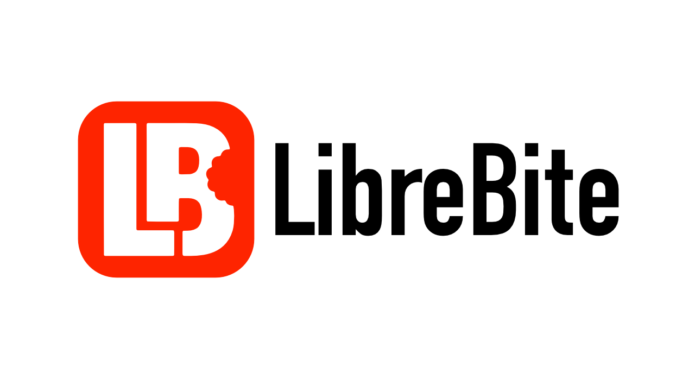

<p align="center">
  
</p>

# Libre Bite

**Die WooCommerce-Erweiterung für Restaurants, Take-Aways, Cafés und Bars.**

[](https://github.com/simurech/libre-bite/releases)
[](https://wordpress.org/)
[](https://woocommerce.com/)
[](https://php.net/)
[](https://www.gnu.org/licenses/gpl-2.0.html)

> Stressfreier Service, volle Teller, glückliche Gäste — Libre Bite ist das WooCommerce-Plugin für Restaurants, Take-Aways und Cafés, die ihre Bestellungen direkt und provisionsfrei abwickeln wollen. Deine Daten bleiben in deiner eigenen WordPress-Installation. Keine Plattformgebühren. Kein Vendor-Lock-in.

**→ [Plugin auf WordPress.org](https://wordpress.org/plugins/libre-bite/)** — vollständige Beschreibung, Screenshots, FAQ und Installation.

---

## Architektur

Libre Bite verwendet eine modulare, klassenbasierte Architektur. Jeder Funktionsbereich ist ein eigenes Modul, das basierend auf den Admin-Einstellungen bedingt geladen wird.

```
libre-bite/
├── libre-bite.php          # Plugin-Bootstrap, Freemius-Init
├── includes/
│   ├── core/               # Installer, Loader, Feature-Toggles, Konstanten
│   ├── admin/              # Admin-Menüs, Einstellungsseiten, Rollen
│   └── modules/            # Funktionsmodule (Kanban, POS, Standorte, Checkout …)
├── templates/
│   ├── admin/              # Admin-Views (Kanban, POS, Wizard, Settings, Help)
│   ├── frontend/           # Menü-Ansicht, Reservierungsformular
│   ├── emails/             # E-Mail-Vorlagen
│   └── *.php               # Checkout- und Standort-Templates
├── assets/
│   ├── css/                # Admin- und Frontend-Stylesheets
│   └── js/                 # Kanban, POS-Oberfläche, Checkout-Skripte
└── vendor/
    └── freemius/           # Freemius SDK (Lizenz- und Abonnementverwaltung)
```

---

## Systemanforderungen

| Komponente | Minimum | Empfohlen |
|---|---|---|
| WordPress | 6.0 | Aktuellste Version |
| WooCommerce | 8.0 | Aktuellste Version |
| PHP | 8.1 | 8.2+ |
| MySQL | 5.6 | 8.0+ / MariaDB 10.4+ |

---

## Installation

**Über WordPress.org (empfohlen):**
1. Im WordPress-Dashboard zu **Plugins → Installieren** navigieren.
2. Nach „Libre Bite" suchen und installieren.

**Manuelle Installation via GitHub:**
1. Die neueste Release-`.zip` von der [Releases-Seite](https://github.com/simurech/libre-bite/releases) herunterladen.
2. In WordPress zu **Plugins → Installieren → Plugin hochladen** navigieren.

**Nach der Aktivierung:**
1. Sicherstellen, dass WooCommerce aktiv ist.
2. Dem Einrichtungsassistenten folgen: Er prüft die Umgebung, lässt die benötigten Module wählen und geht anschliessend jedes eingeschaltete Modul einzeln durch, um dessen wichtigste Einstellungen abzufragen. Jeder Schritt lässt sich überspringen, und auf Wunsch legt er eine Beispielkarte an.
3. Alternativ direkt im Admin-Menü zu **Libre Bite** navigieren und Standort(e) konfigurieren.

> Der Assistent lässt sich jederzeit erneut öffnen, auch auf einem bereits eingerichteten Shop: Alle Felder sind mit den aktuellen Werten vorbelegt, blosses Durchklicken verändert nichts. Zugriff haben Administratoren, Manager und Shop-Manager — Kassenpersonal bewusst nicht.

**Farbschema:** Die Libre-Bite-Seiten folgen wahlweise der Systemeinstellung oder stehen fest auf hell beziehungsweise dunkel. Einstellbar unter **Libre Bite → Einstellungen → Branding** oder im WordPress-Profil. Die Wahl gilt pro Benutzer, damit Küchen-Tablet und Bürorechner sich unterscheiden dürfen.

---

## Lizenz

**Libre Bite** steht unter der [GNU General Public License v2.0 oder später](https://www.gnu.org/licenses/gpl-2.0.html).

**Autor:** Pulacha Labs — [@simurech](https://github.com/simurech)
